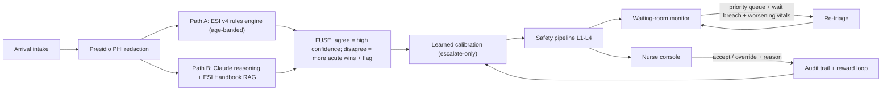

# PatientTriage.ai

**AI-assisted emergency department triage that does not stop at the door.** It scores every arriving patient with a dual-path engine (deterministic ESI rules in parallel with LLM clinical reasoning), then keeps watching everyone in the waiting room and tells the nurse who to check on next.

Team **NamoFans** (IIT Kharagpur): Monika Kumari (Team Leader), Animesh Raj, Anshuman Sharma. Accenture Innovation Challenge 2026, Round 2, Problem Track 2.

> The system recommends. The clinician decides. Always.

---

## Why this exists

Triage today is a snapshot: a patient is scored once at arrival and then nobody systematically re-examines them. An ESI-3 patient can silently deteriorate toward ESI-1 in the waiting room, and in sepsis every hour of treatment delay raises mortality by roughly 8% (Kumar et al.). Existing AI triage systems (ED-Triage-Agent, TriageAgent) automate the initial score and stop at the door.

PatientTriage.ai treats the waiting room as part of triage:

1. **Phase 1, Intake.** Structured first-minutes data only: chief complaint, vitals, age, medications if on file. Half of real patients have no record at all; the system is designed for that.
2. **Phase 2, Dual-path scoring.** Path A is a deterministic ESI v4 rules engine with age-banded vital thresholds. Path B is Claude reasoning over the redacted intake, grounded in retrieved ESI Handbook passages. A FUSE step combines them: agreement means high confidence; disagreement takes the MORE acute level, lowers confidence, and flags the clinician with both reasoning chains.
3. **Phase 3, Dynamic reassessment (the novel loop).** Every waiting patient is ranked continuously by `deterioration_risk x wait_pressure x acuity_uncertainty x severity`. Two hard triggers fire regardless of the score: a per-ESI safe-wait breach, and a vitals recheck that worsens past thresholds or enters the age-banded danger zone. Deterioration causes automatic re-triage, which may only hold or escalate the level, never lower it.

## Safety by construction

The brief asks for a system "deliberately tuned to bias toward escalation under uncertainty rather than optimized for average accuracy." Here that bias is structural, not a prompt suggestion:

- **FUSE takes the more acute level on any disagreement.** Uncertainty can never downgrade a patient (`backend/app/agent/fuse.py`, unit-tested).
- **Missing core vitals escalate** rather than default to average assumptions (`backend/app/engine/esi_rules.py`).
- **Age-banded thresholds**: the same HR 110 is danger-zone for a 40-year-old and normal for a 4-year-old; the same 38.5 C fever is ESI-2 for a neonate, sepsis-watch ESI-3 for a 75-year-old, and ESI-4 for a healthy adult. A single adult-calibrated model across ages is a silent safety risk; we do not have one.
- **A 4-layer safety pipeline** (input completeness, clinical grounding floor, red-flag propagation, per-age-band bias counters) wraps every recommendation (`backend/app/safety/pipeline.py`).
- **The NEVER list is structural.** Nothing in this codebase finalizes an ESI level, blocks a patient, or overrides a clinician. Only a clinician action moves a patient to treatment.
- **Deterioration re-triage never downgrades**, and the learning loop (below) is only allowed to escalate.

## Results against published benchmarks

We evaluate on the exact case sets used by two published systems, with their metrics, so the comparison is apples to apples. Under-triage (assigning less acuity than the truth) is the metric that harms patients; it is our hero metric, deliberately traded against over-triage.

**TriageAgent public benchmark** (EMNLP 2024 Findings; three test sets, 216 cases):

| System | Exact | Under-triage | Significant under-triage | High-acuity sensitivity |
|---|---|---|---|---|
| **PatientTriage.ai FUSED (Claude Sonnet 5)** | 71.3% | **1.4%** | **0.0%** | **100%** |
| TriageAgent + GPT-4 (published SOTA) | 81.0% | 2.30% | 2.80% | n/a |
| Human experts (published in same paper) | 68.6% | 12.80% | 8.61% | n/a |
| PatientTriage.ai FUSED (Claude Haiku 4.5, budget config) | 61.1% | 2.8% | 0.0% | 100% |
| PatientTriage.ai LLM path only (Sonnet 5) | 76.9% | 8.8% | 0.0% | 96.0% |
| PatientTriage.ai rules path only | 31.0% | 43.1% | 22.7% | 51.0% |

Three things to read from that table. First, the fused system beats published SOTA on both under-triage (1.4% vs 2.30%) and significant under-triage (0.0% vs 2.80%), catches 100% of ESI-1/2 patients, and exceeds the human-expert accuracy baseline, all with a general-purpose model and no fine-tuning. Second, the fusion is doing real work: it cuts the LLM path's under-triage from 8.8% to 1.4% (a 6x safety improvement) at the cost of 5.6 points of exact accuracy. Third, that cost shows up as over-triage (27.3% vs SOTA's 17.1%), which is exactly the asymmetric trade the problem brief demands, made explicit and measured. Even the budget Haiku configuration holds 0.0% significant under-triage.

**ESI Handbook 60-case benchmark** (the set ED-Triage-Agent, medRxiv 2026, evaluated on): our fused Sonnet configuration reaches 5.0% under-triage, 0% significant under-triage, and 100% high-acuity sensitivity; exact accuracy (51.7%) is below ETA's multi-agent GPT-4.1-mini pipeline (80% exact, 0% under-triage), whose two-phase interview design is tuned to these narrative teaching cases. On the larger public benchmark above, our single-pass system closes most of that gap while staying safer. Full per-set numbers are in `eval/results/`.

**Hospital-local configuration, measured honestly:** we also benchmarked the pipeline with [Doctor-R1](https://huggingface.co/unicornftk/Doctor-R1) (ICLR 2026; Qwen3-8B, MIT) served locally via an OpenAI-compatible endpoint, 4-bit quantized on Apple Silicon. On the 60-case set it reaches 33.3% exact and 73.1% high-acuity sensitivity standalone, and the fused system still holds 0.0% significant under-triage on top of it. The quality gap versus cloud Claude is real and quantified; the point is that the privacy option exists, runs on a laptop, and the safety floor holds either way.

Reproduce any row with one command (see Quick start), and every raw prediction is stored alongside the metrics.

## The learning loop (clinician overrides as reward)

Every clinician action becomes a logged experience tuple (the experience-repository pattern from Doctor-R1, ICLR 2026). Rewards mirror the brief's asymmetric costs: acceptance +1.0; an over-triage override costs 0.2 per level; an under-triage override (the dangerous miss) costs 1.0 per level.

The online learner is deliberately conservative: a calibration table over (complaint category x age band) cells. When clinicians repeatedly escalate a cell, the system learns to escalate it at triage time. The learned adjustment can only move toward MORE acute, so reinforcement learning cannot break the safety invariant by construction. Try it live: override two similar patients upward in the dashboard, and the third arrives pre-escalated with a note explaining why.

Full policy optimization (GRPO per Doctor-R1, multi-axis rewards per ResidencyRL) is our stated Round 3 path once real override volume exists.

## Hospital-local mode (privacy) and PHI protection

- **Microsoft Presidio redacts PHI** (names, phone numbers, addresses, identifiers) from free text BEFORE any LLM call and before any audit log write. Clinical content passes through untouched. This is code, not a policy paragraph.
- **Assumed jurisdiction: HIPAA (US).** The audit trail is append-only (DuckDB). A clinician override must legally record the original recommendation, the new level, the clinician identifier, the timestamp, and a stated reason; our `OverrideRecord` type makes an incomplete override unconstructable, and the API rejects an override without a reason (HTTP 422).
- **The reasoning path is pluggable.** Default is Claude on AWS Bedrock. Point one environment variable at any OpenAI-compatible local server (Ollama, mlx_lm.server) and the same pipeline runs fully on-premises; we ship an evaluated configuration using **Doctor-R1** (Qwen3-8B, MIT, RL-trained for clinical inquiry) so patient data never has to leave the hospital at all.

## Scalability: one YAML per hospital

`config/rural_100.yaml` and `config/urban_500.yaml` drive per-ESI safe wait limits, reassessment cadence, deterioration sensitivity, and the surge threshold. The same assistant flexes from a 100-visit rural ED to a 500-visit urban trauma center by swapping a file.

**Surge behavior (tested at 3x arrivals):** when the waiting count crosses the profile threshold, arrivals switch automatically to the deterministic fast path (about 4 ms per triage in our runs), clinician flags are preserved, and the monitoring loop keeps firing. The LLM becomes async enrichment, never a bottleneck. `scripts/replay_demo.py --speedup 3 --profile rural_100` demonstrates it.

## Adoption and change management

A fatigued nurse will not use a tool that nags. The UX choices come from that reality:

- **Passive surfacing.** The reassessment queue reorders; it does not interrupt. Hard alerts are reserved for the two mandated triggers (wait breach, deterioration).
- **One-click accept, one-form override.** The override form is the same card, three fields, and the reason requirement doubles as the legal record, not extra bureaucracy.
- **Both reasoning chains are always visible**, including when they disagree. Nurses calibrate trust by watching where the system is unsure, which our own data shows is exactly where their attention matters (every fused disagreement is flagged for review).
- **Overrides visibly teach the system.** The dashboard tells the clinician their override became a learning signal. People trust tools that admit being corrected.

## Architecture



| Component | Where | Notes |
|---|---|---|
| ESI v4 rules engine | `backend/app/engine/` | Deterministic, auditable, no LLM |
| LLM reasoning path | `backend/app/agent/llm_path.py` | Claude via Bedrock (or any OpenAI-compatible local server); disk replay cache |
| ESI Handbook RAG | `backend/app/agent/rag.py` | BM25 over page chunks, page-cited, fully offline |
| FUSE orchestrator | `backend/app/agent/fuse.py` | LangGraph parallel fan-out, fan-in |
| Waiting-room monitor | `backend/app/monitor/` | Sim-clock driven; production swap is a real scheduler |
| Safety pipeline | `backend/app/safety/` | Grounding floor, completeness, red flags, bias counters |
| Audit + overrides | `backend/app/audit/` | DuckDB append-only, HIPAA-shaped override record |
| Learning loop | `backend/app/learning/` | Asymmetric rewards, escalate-only calibration |
| Evaluation harness | `eval/run_eval.py` | Published-benchmark metrics, reproducible |
| Nurse console | `frontend/` | React + Vite |

## Quick start

Prerequisites: Python 3.12+ with [uv](https://docs.astral.sh/uv/), Node 20+.

```bash
git clone https://github.com/wildcraft958/patient-triage-ai
cd patient-triage-ai

# 1. Backend environment
cd backend
uv sync

# 2. Data (MIMIC-IV-ED demo, ESI eval sets, ESI Handbook; ~3 MB)
uv run python ../scripts/fetch_data.py

# 3. Tests and server
uv run pytest                     # 77 tests
cp ../env.example ../.env         # then fill LLM_API_KEY (see below)
uv run uvicorn app.main:app --port 8000

# 4. Frontend (new terminal)
cd frontend
npm install
npm run dev                       # http://localhost:5173

# 5. In the dashboard: Load scenario -> Next event, step through the timeline
```

**LLM access.** Set `LLM_API_KEY` (AWS Bedrock API key) and `LLM_REGION` in `.env`; default model is `anthropic.claude-haiku-4-5`. Without a key the system still runs end to end in rules-only mode (every recommendation notes it), and all previously seen prompts are served from the replay cache in `data/cache/`.

**Hospital-local mode (no cloud):** serve any OpenAI-compatible model locally (for example `ollama serve` or `mlx_lm.server`) and pass `--local-url`/`--local-model` to the eval harness, or point the transport at it. We benchmarked `unicornftk/Doctor-R1` this way.

**Headless demos:**

```bash
cd backend
uv run python ../scripts/replay_demo.py                          # full timeline
uv run python ../scripts/replay_demo.py --speedup 3 --profile rural_100   # 3x surge
uv run python ../eval/run_eval.py --sets test_1 test_2 test_3    # 216-case benchmark
```

## Data and licenses

- `data/curated_patients.json`: 22 simulated patients written by us, covering every mandated case (ambiguous presentation, pediatric, geriatric, zero-history, a sepsis-trajectory deteriorator with worsening rechecks; roughly half have prior records).
- MIMIC-IV-ED **Demo** v2.2 (PhysioNet, open access, ODbL): fetched at setup, never committed. The full 440K-visit MIMIC-IV-ED replay is our Round 3 evaluation path.
- ESI scenario benchmarks and ESI v4 Handbook: fetched from the MIT-licensed [ED-Triage-Agent](https://github.com/Karthick47v2/ED-Triage-Agent) repository (c) Karthick T. Sharma; the three test sets originate from [TriageAgent](https://aclanthology.org/2024.findings-emnlp.329/) (EMNLP 2024 Findings).
- No real patient data is used anywhere. Presidio redaction runs regardless, because the pipeline is built as if data were real.

## References

1. ED-Triage-Agent: a framework for human-AI collaborative emergency triage. medRxiv, 2026. (Baseline system and 60-case evaluation protocol.)
2. TriageAgent: multi-agent collaboration for LLM-based clinical triage. EMNLP 2024 Findings. (Public benchmark and human-expert baseline.)
3. Doctor-R1: mastering clinical inquiry with experiential agentic reinforcement learning. ICLR 2026. (Experience repository pattern; hospital-local model.)
4. ResidencyRL: reinforcement learning for clinical agents via simulated encounters. arXiv, Aug 2026. (Multi-axis reward design for the Round 3 path.)
5. NEJM AI study of AI-assisted ED triage across 174,648 visits. (33% time-to-care reduction; 78.8% to 83.1% critical-care identification.)
6. Kumar et al., duration of hypotension before antimicrobial therapy in septic shock. (The mortality-per-hour figure behind the danger window.)
7. Emergency Severity Index v4 Implementation Handbook. (Path A rules and the age-banded danger-zone vitals.)
