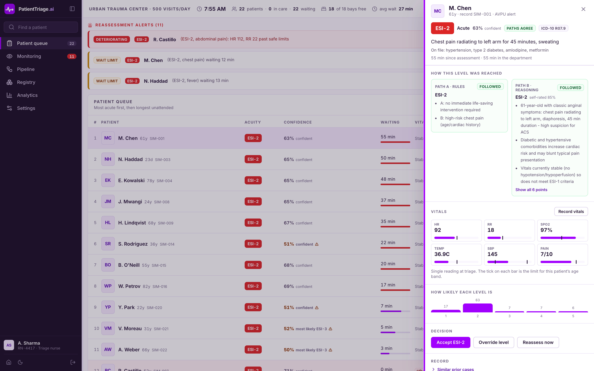
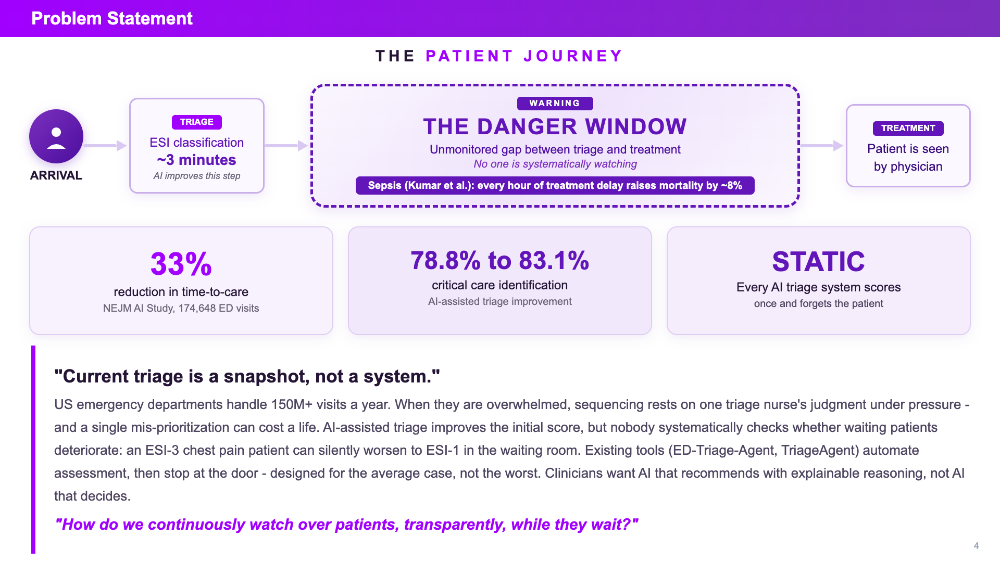
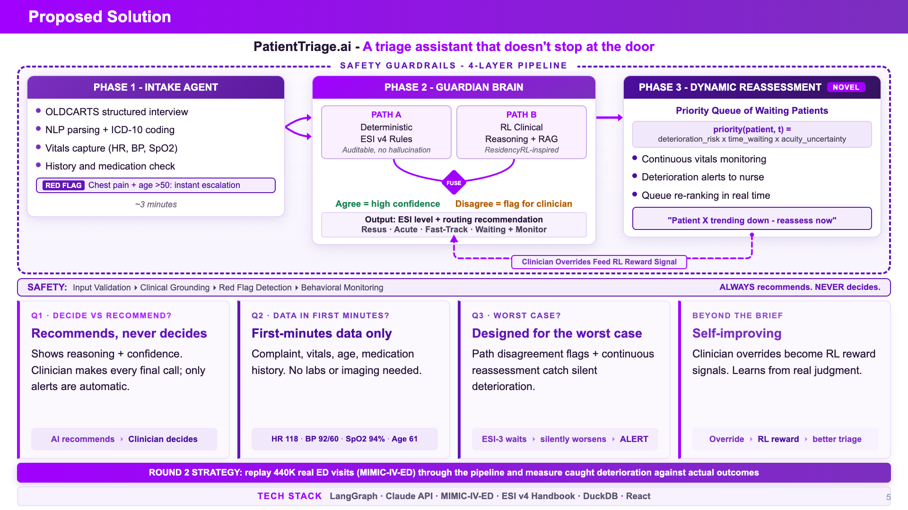
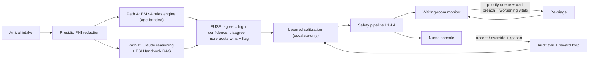
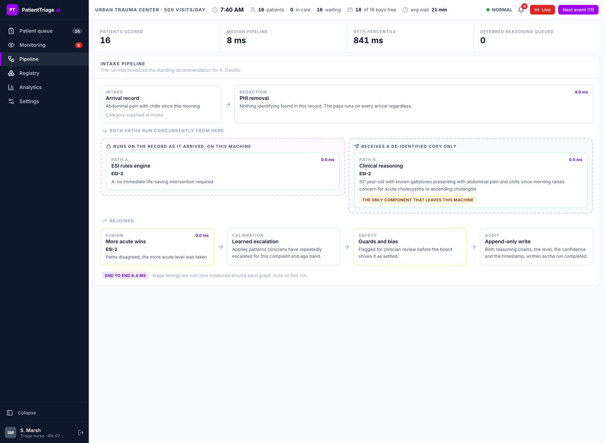
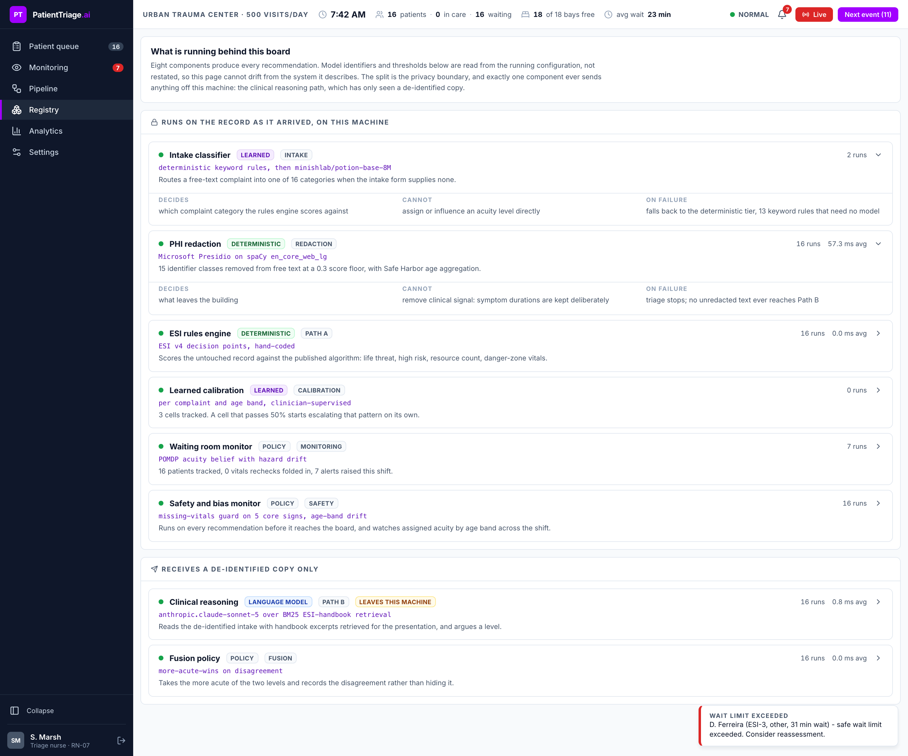
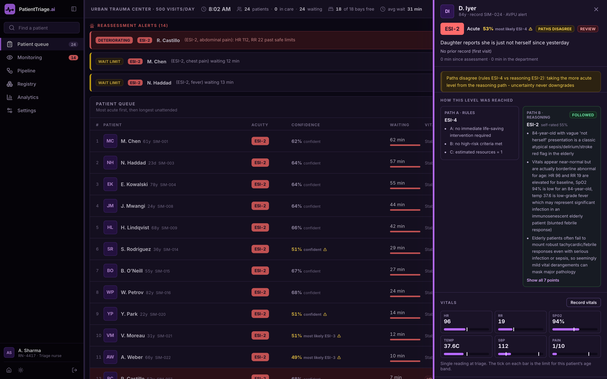

**AI-assisted emergency department triage that does not stop at the door.** It scores every arriving patient with a dual-path engine (deterministic ESI rules in parallel with LLM clinical reasoning), then keeps watching everyone in the waiting room and tells the nurse who to check on next.

Team **NamoFans** (IIT Kharagpur): Monika Kumari (Team Leader) and Animesh Raj. Accenture Innovation Challenge 2026, Round 2, Problem Track 2.

> The system recommends. The clinician decides. Always.

**Live demo: https://patient-triage-ai-s5hk.onrender.com** (may take up to a minute to wake from idle)



The console is a signed-in clinical workstation, not a dashboard. You sign in with a badge and a role, and the role changes what the board allows: a triage nurse sets acuity levels, a medical assistant records vitals but cannot, an administrator reads without touching. Six sections. **Patient queue** ranks by acuity and shows each patient's level, belief, wait against the safe limit for that level, and vitals trend. **Monitoring** ranks the same people by reassessment priority, which is a different question and gets its own screen. **Pipeline** traces the run that produced the selected patient's recommendation, with measured time per stage and the identifier classes redaction removed. **Registry** lists every component with the model ids read from live configuration. **Analytics** carries the held-out benchmark, the bias monitor, and every clinician decision with the badge attached. **Settings** shows a department its own thresholds. Alerts sit above all of it, and answering one is two clicks: reassess, or acknowledge. Both are written to the audit trail. The rail and the patient record drag to whatever width the workstation has, and the whole surface has a night theme, because a twelve-hour shift is not always a daytime one.

---

## Why this exists

Triage today is a snapshot: a patient is scored once at arrival and then nobody systematically re-examines them. An ESI-3 patient can silently deteriorate toward ESI-1 in the waiting room, and in sepsis every hour of treatment delay raises mortality by roughly 8% (Kumar et al.). Existing AI triage systems (ED-Triage-Agent, TriageAgent) automate the initial score and stop at the door.



PatientTriage.ai treats the waiting room as part of triage:

1. **Phase 1, Intake.** Structured first-minutes data: chief complaint (free text), vitals, age, AVPU, medications if on file, and an optional OLDCARTS structured interview (Onset, Location, Duration, Characteristics, Aggravating/Alleviating, Radiation, Timing/Triggers, Severity 1-10) whose severity answer feeds the ESI pain gate. A **two-tier intake classifier** reads the complaint text (`backend/app/engine/complaint.py`): a deterministic rule tier (exact clinical keywords, fuzzy phrases with bounded edit distance over accent-folded tokens for misspellings and Spanish and Hinglish phrasings, and a compound obstetric-emergency predicate) resolved by clinical risk so a high-risk match always beats a benign one; and, only where the rules are silent, a **distilled machine-learned tier** (`complaint_ml.py`): Model2Vec static embeddings (a sentence transformer distilled to a 30MB numpy-only artifact) with a logistic head trained on clinically reviewed real MIMIC-IV-ED chief complaints, speaking only above risk-tiered confidence floors and abstaining otherwise. The category auto-codes to a provisional ICD-10. Half of real patients have no record at all; the system is designed for that.
2. **Phase 2, Dual-path scoring.** Path A is a deterministic ESI v4 rules engine with age-banded vital thresholds. Path B is Claude reasoning over the redacted intake, grounded in retrieved ESI Handbook passages. A FUSE step combines them: agreement means high confidence; disagreement takes the MORE acute level, lowers confidence, and flags the clinician with both reasoning chains.
3. **Phase 3, Dynamic reassessment (the novel loop).** Triage is formalized as a POMDP: the hidden state is the patient's true acuity, and each patient carries a live belief - a probability distribution over ESI 1-5 - initialized from the two paths (disagreement IS the uncertainty), drifted acute-ward by a deterioration hazard while they wait, and Bayes-updated by every vitals recheck from any channel (nurse spot-check, wearable, kiosk self-report). The policy over that belief ranks the room:

   `priority = deterioration_risk x time_since_last_assessment x acuity_uncertainty x esi_severity_weight`

   where acuity_uncertainty is the belief's entropy and the score maps to [0,1] with a REASSESS NOW threshold. Two hard triggers fire regardless of the score: a per-ESI safe-wait breach, and a worsening or danger-zone recheck. Deterioration causes automatic re-triage, which may only hold or escalate the level, never lower it. Run the counterfactual yourself: `uv run python ../scripts/ab_demo.py` replays the same deteriorating patient with the monitor off and on.

## Safety by construction

The brief asks for a system "deliberately tuned to bias toward escalation under uncertainty rather than optimized for average accuracy." Here that bias is structural, not a prompt suggestion:

- **FUSE takes the more acute level on any disagreement.** Uncertainty can never downgrade a patient (`backend/app/agent/fuse.py`, unit-tested).
- **Danger-zone vitals escalate every category.** Measured deranged vitals uptriage to ESI-2 even when the complaint category says minor, because deranged vitals mean the category is wrong: anaphylaxis mis-coded as "other" with SBP 80 still lands at ESI-2 (`backend/app/engine/esi_rules.py`, executed in tests).
- **Missing core vitals escalate** multi-resource complaints rather than default to average assumptions; low-acuity complaints are flagged for vitals collection instead, because ESI v4 assigns levels 4 and 5 without vitals (`backend/app/engine/esi_rules.py`).
- **High-risk downgrades require explicit acknowledgment.** Overriding a red-flagged or ESI 1-2 patient down two or more levels returns HTTP 422 until the clinician confirms they reviewed the flagged risk; the confirmed downgrade is applied and audited as a safety flag. A confirmed clinician decision is never blocked.
- **Age-banded thresholds**: the same HR 110 is danger-zone for a 40-year-old and normal for a 4-year-old; the same 38.5 C fever is ESI-2 for a neonate, sepsis-watch ESI-3 for a 75-year-old, and ESI-4 for a healthy adult. A single adult-calibrated model across ages is a silent safety risk; we do not have one.
- **A 4-layer safety pipeline** (input completeness, clinical grounding floor, red-flag propagation, per-age-band bias counters) wraps every recommendation (`backend/app/safety/pipeline.py`).
- **The NEVER list is structural.** Nothing in this codebase finalizes an ESI level, blocks a patient, or overrides a clinician. A level set by a clinician is final for automation: even the surge enrichment queue, when it disagrees with a decision made while it was waiting, attaches its reasoning as an advisory note and flags the disagreement instead of rescoring (`TriageService.process_enrichment`). Only a clinician action moves a patient to treatment.
- **Deterioration re-triage never downgrades**, and the learning loop (below) is only allowed to escalate.

## Results against published benchmarks

We evaluate on the exact case sets used by two published systems, with their metrics, so the comparison is apples to apples. Under-triage (assigning less acuity than the truth) is the metric that harms patients; it is our hero metric, deliberately traded against over-triage.

**TriageAgent public benchmark** (EMNLP 2024 Findings; three test sets, 216 cases):

| System | Exact | Under-triage | Significant under-triage | High-acuity sensitivity |
|---|---|---|---|---|
| **PatientTriage.ai FUSED (Claude Sonnet 5)** | 68.5% | **1.4%** | **0.0%** | **100%** |
| TriageAgent + GPT-4 (published SOTA) | 81.0% | 2.30% | 2.80% | n/a |
| Human experts (published in same paper) | 68.6% | 12.80% | 8.61% | n/a |
| PatientTriage.ai FUSED (Claude Haiku 4.5, budget config) | 58.3% | 2.3% | 0.0% | 100% |
| PatientTriage.ai LLM path only (Sonnet 5) | 76.9% | 8.8% | 0.0% | 96.0% |
| PatientTriage.ai rules path only | 33.8% | 37.5% | 17.1% | 63.0% |

Three things to read from that table. First, the fused system beats published SOTA on both under-triage (1.4% vs 2.30%) and significant under-triage (0.0% vs 2.80%), catches 100% of ESI-1/2 patients, and matches the human-expert accuracy baseline, all with a general-purpose model and no fine-tuning. Second, the fusion is doing real work: it cuts the LLM path's under-triage from 8.8% to 1.4% (a 6x safety improvement) at the cost of 8.4 points of exact accuracy. Third, that cost shows up as over-triage (30.1% vs SOTA's 17.1%), which is exactly the asymmetric trade the problem brief demands, made explicit and measured. Even the budget Haiku configuration holds 0.0% significant under-triage.

**Reproducibility.** Every number above reproduces offline from response caches committed to this repo, with zero API keys, in one command - anyone can verify the exact table. A live re-run with a different model or sampling will naturally vary; the safety invariants (rules floor, more-acute-wins, escalate-only learning) hold regardless of the model behind Path B. Per-case predictions, agreement flags, and data caveats (26 of 216 cases state no age and are marked `age_defaulted`) are stored alongside the metrics in `eval/results/`.

**ESI Handbook 60-case benchmark** (the set ED-Triage-Agent, medRxiv 2026, evaluated on): our fused Sonnet configuration reaches 5.0% under-triage, 0% significant under-triage, and 100% high-acuity sensitivity; exact accuracy (51.7%) is below ETA's multi-agent GPT-4.1-mini pipeline (80% exact, 0% under-triage), whose two-phase interview design is tuned to these narrative teaching cases. On the larger public benchmark above, our single-pass system closes most of that gap while staying safer. Full per-set numbers are in `eval/results/`.

**Hospital-local configuration, measured honestly:** we also benchmarked the pipeline with [Doctor-R1](https://huggingface.co/unicornftk/Doctor-R1) (ICLR 2026; Qwen3-8B, MIT) served locally via an OpenAI-compatible endpoint, 4-bit quantized on Apple Silicon. On the 60-case set it reaches 33.3% exact and 73.1% high-acuity sensitivity standalone, and the fused system still holds 0.0% significant under-triage on top of it. The quality gap versus cloud Claude is real and quantified; the point is that the privacy option exists, runs on a laptop, and the safety floor holds either way.

Reproduce any row with one command (see Quick start), and every raw prediction is stored alongside the metrics.

## The learning loop (clinician actions as RL training signal)

Every clinician action becomes a logged experience tuple in the audit trail - the experience-repository pattern from Doctor-R1 (ICLR 2026) - scored by a **multi-axis reward structure per ResidencyRL**: diagnostic accuracy, management quality, communication, documentation, and safety (`backend/app/learning/loop.py`, per-axis means live in `/metrics`). All five axes price the scalar: an unexplained rules-only recommendation or an incomplete override record deducts from the episode score (0.1 weight each). The safety axis dominates by design, mirroring the brief's asymmetric costs: acceptance +1.0; an over-triage override costs 0.2 per level on the management axis; an under-triage override (the dangerous miss) costs 1.0 per level on the safety axis - five times the maximum combined soft-axis deduction.

Two learners consume the repository:

- **Online**: a conservative calibration table over (complaint category x age band) cells. When clinicians repeatedly escalate a cell, the system escalates it at triage time. Try it live: override two similar patients upward in the console, and the third arrives pre-escalated with a note explaining why.
- **Batch**: **GRPO** (Doctor-R1's training algorithm) over the logged experience - `backend/app/learning/grpo.py` groups episodes per cell, scores each factual outcome against the counterfactual escalated recommendation with the same reward model, normalizes advantages within the group critic-free, and writes the resulting escalation policy into the same calibration table. Run it on the audit trail: `uv run python ../scripts/train_policy.py`.

Both learners share one structural invariant: the learned adjustment can only move toward MORE acute, so reinforcement learning cannot break the escalation-safety guarantee by construction. Model-weight fine-tuning is deliberately out of scope for a triage assistant that must stay auditable; the decision layer is where the override signal accumulates, and that is what trains.

## Hospital-local mode (privacy) and PHI protection

- **Microsoft Presidio redacts every free-text field** (chief complaint, medication and condition strings, all OLDCARTS answers) BEFORE any LLM call; the audit log stores derived recommendations and reasoning, not raw complaint text. Clinical content passes through untouched. This is code, not a policy paragraph. Safe Harbor coverage works three ways: 15 identifier classes are actively detected and redacted (names, phones, emails, locations, SSNs, licenses, passports, financial and network identifiers); names, birth dates, and record numbers are additionally never collected by the intake schema (patient_id never reaches the LLM); and symptom durations deliberately pass through because they are the clinical signal the ESI decision points run on - Safe Harbor's date identifier concerns identity-linked dates, not "crushing pain for 45 minutes". Ages ride the same line, and the Safe Harbor ceiling is enforced: a 74-year-old reaches the model as written because the age band drives the decision, while every age over 89 is aggregated to "90 or older" in the free text and in the structured field, so only the deterministic rules that never leave the building see the exact number.
- **Assumed jurisdiction: HIPAA (US).** The audit trail is append-only (DuckDB). A clinician override must legally record the original recommendation, the new level, the clinician identifier, the timestamp, and a stated reason; our `OverrideRecord` type makes an incomplete override unconstructable, and the API rejects an override without a reason (HTTP 422).
- **Consent and retention.** The assumed consent model is treatment-context consent collected at ED registration (HIPAA treatment-operations basis); triage recommendations and override records are retained in the append-only audit store for the medical-record retention period of the jurisdiction (six years under HIPAA), while raw free-text intake never enters long-term storage - only redacted, derived records do.
- **The reasoning path is pluggable.** Default is Claude on AWS Bedrock. Point one environment variable at any OpenAI-compatible local server (Ollama, mlx_lm.server) and the same pipeline runs fully on-premises; we ship an evaluated configuration using **Doctor-R1** (Qwen3-8B, MIT, RL-trained for clinical inquiry) so patient data never has to leave the hospital at all.
- **EHR integration via FHIR.** `GET /patients/{id}/fhir` exports the full episode as a FHIR R4 Bundle: de-identified Patient, LOINC-coded Observations for every recorded vital, a RiskAssessment carrying the recommendation with the acuity belief as per-level probabilities plus both reasoning chains, and a Provenance record. Patient-record systems consume this directly; bed management and staff rosters hang off the same seam.

## Scalability: one YAML per hospital

`config/rural_100.yaml` and `config/urban_500.yaml` drive per-ESI safe wait limits, reassessment cadence, deterioration sensitivity, and the surge threshold. The same assistant flexes from a 100-visit rural ED to a 500-visit urban trauma center by swapping a file.

**Surge behavior (tested at 3x arrivals):** when the waiting count crosses the profile threshold, arrivals switch automatically to the deterministic fast path, clinician flags are preserved, and the monitoring loop keeps firing. Path B is deferred, not dropped: each surge arrival joins an enrichment queue that drains on the next clock tick, attaches the LLM reasoning, and may only hold or escalate the standing level (audited as `surge_enrichment`, escalations surface in the console feed). `scripts/replay_demo.py --speedup 3 --profile rural_100` demonstrates it end to end. In production the same queue would be drained by a background worker instead of the sim clock.

**Latency, measured honestly:** rules scoring is sub-millisecond; the full intake-to-recommendation pipeline (redaction + both paths + calibration + safety) runs in the low tens of milliseconds warm when the LLM answer is cached, and 1 to 3 seconds on a live LLM call; the first request pays a one-time spaCy model load. `/metrics` reports live p50/p95, and every triage audit event records its own `latency_ms`.

## Adoption and change management

A fatigued nurse will not use a tool that nags. The UX choices come from that reality:

- **Passive surfacing.** The reassessment queue reorders; it does not interrupt. Hard alerts are reserved for the two mandated triggers (wait breach, deterioration).
- **One-click accept, one-form override.** The override form is the same card, three fields, and the reason requirement doubles as the legal record, not extra bureaucracy.
- **Both reasoning chains are always visible**, including when they disagree. Nurses calibrate trust by watching where the system is unsure, which our own data shows is exactly where their attention matters (every fused disagreement is flagged for review).
- **Overrides visibly teach the system.** The dashboard tells the clinician their override became a learning signal. People trust tools that admit being corrected.

## Architecture

**As pitched in Round 1** (every element below now exists as running code):



**As built:**



The console renders that same graph live for whichever patient is selected,
with the wall time each stage actually took on that run, and marks the one
component that sends anything off the machine.



Every component is also listed with the model identifier read from the running
process rather than restated, so the page cannot drift from the container it
describes.



The same console at night. Acuity colour is not inverted with everything else:
dark mode lifts the five ESI fills and flips their text, so the order a nurse
reads before reading the number survives the theme.



| Component | Where | Notes |
|---|---|---|
| ESI v4 rules engine | `backend/app/engine/` | Deterministic, auditable, no LLM |
| Intake classifier | `backend/app/engine/complaint.py`, `complaint_ml.py` | Two tiers: risk-resolved rules, then a distilled static-embedding model (numpy-only) that fills rule silence |
| LLM reasoning path | `backend/app/agent/llm_path.py` | Claude via Bedrock (or any OpenAI-compatible local server); disk replay cache |
| ESI Handbook RAG | `backend/app/agent/rag.py` | BM25 over page chunks, page-cited, fully offline |
| FUSE orchestrator | `backend/app/agent/fuse.py` | LangGraph parallel fan-out, fan-in |
| POMDP belief state | `backend/app/monitor/belief.py` | Acuity distribution: initialized from path disagreement, hazard drift, Bayes updates on rechecks |
| Reassessment policy | `backend/app/monitor/priority.py` | The 4-factor priority product over the belief, [0,1] with REASSESS NOW threshold |
| Waiting-room monitor | `backend/app/monitor/waiting_room.py` | Owns the belief lifecycle; wait-breach + deterioration triggers, alert cooldown |
| Safety pipeline | `backend/app/safety/` | Grounding floor, completeness, red flags, bias counters with alert trigger |
| Audit + overrides | `backend/app/audit/` | DuckDB append-only, HIPAA-shaped override record, SQL analytics for /metrics |
| Multi-axis rewards | `backend/app/learning/loop.py` | Five ResidencyRL axes; safety dominates; escalate-only calibration |
| GRPO optimizer | `backend/app/learning/grpo.py` | Group-relative advantages over the experience repository; `scripts/train_policy.py` |
| ICD-10 coding + FHIR export | `backend/app/engine/icd10.py`, `backend/app/fhir.py` | Provisional encounter codes; FHIR R4 Bundle per episode |
| Evaluation harness | `eval/run_eval.py` | Published-benchmark metrics, reproducible |
| Product site + nurse console | `frontend/` | React + Vite + Tailwind; product site at `/`, console at `/console`: badge sign-in with three roles enforced server-side, acuity-ranked queue, reassessment board, live pipeline trace, component registry, analytics, one-click override, OLDCARTS intake form, light and dark themes, resizable panes |

### The intake classifier: distillation end to end

Free-text complaint understanding is a studied, hard problem (published supervised models reach F1 near 47 on chief complaints), and we engineered it rather than hand-waving it. The design was chosen by elimination against hard constraints - deterministic and key-free for anyone reproducing this repo, a 512MB deployment budget, and guaranteed recall on red-flag presentations:

- **Keyword lists alone** are brittle against misspellings, paraphrase, and other languages.
- **BM25 or TF-IDF nearest-neighbor** was evaluated and rejected: retrieval scores are unbounded and not comparable across queries, so the risk-tiered confidence thresholds this design needs cannot be calibrated on them, and every added example silently shifts every score.
- **Full transformers** (clinical BERT trained on 1.8M ED complaints exists) blow the memory budget and add a torch or ONNX runtime for marginal gain at this category granularity.

What ships instead: a deterministic rule tier that is the guaranteed-recall contract (a red-flag phrase maps to its protocol 100% of the time, provably, pinned by tests), and beneath it a **distilled classifier** - [Model2Vec](https://github.com/MinishLab/model2vec) static embeddings (a full sentence transformer distilled into a 30MB, numpy-only artifact, MIT) with a class-balanced logistic head trained by `scripts/train_complaint_classifier.py` on **clinically reviewed labels over real MIMIC-IV-ED chief complaints** plus adversarial phrasings. Softmax gives bounded, calibrated probabilities, so the model accepts a high-risk call at lower confidence than a benign one and abstains below both floors; training is zero-init on a convex objective, so the committed artifact is bit-reproducible with no random seed, and the run reports its own loss curve so a converged fit is verified rather than assumed. A committed snapshot fixture freezes the classification of every benchmark and demo text, making any drift a visible, reviewed event. The generalization claim is enforced the same way: the disguised-presentation probes in the test suite are measured against every training row, and a future row that paraphrases one of them turns the suite red instead of quietly inflating the claim. Fixing the next unseen phrasing is one labeled row in `data/complaint_examples.json` and a deterministic retrain.

The pattern is the same one that runs through the whole system: Claude's reasoning is distilled into the replay corpus, Doctor-R1 is a distilled clinician for the hospital-local option, and the intake classifier is a transformer distilled into an artifact small enough to run anywhere - with the deterministic layers as the safety floor and the dual-path fusion as the net beneath everything.

## Quick start

Prerequisites: Python 3.12+ with [uv](https://docs.astral.sh/uv/), Node 20+.

```bash
git clone https://github.com/wildcraft958/patient-triage-ai
cd patient-triage-ai

# 1. Backend environment
cd backend
uv sync

# 2. Data (MIMIC-IV-ED demo, ESI eval sets, ESI Handbook; ~3 MB)
uv run python ../scripts/fetch_data.py

# 3. Tests and server
uv run pytest                     # 221 tests
cp ../env.example ../.env         # then fill LLM_API_KEY (see below)
uv run uvicorn app.main:app --port 8000

# 4. Frontend (new terminal)
cd frontend
npm install
npm test                          # 63 tests
npm run dev                       # http://localhost:5173

# 5. localhost:5173 opens the product site; "Launch console" (or /console)
#    opens the nurse console: sign in -> open a shift. The clock runs live
#    by default at one department minute every four seconds; Next event
#    steps the shift one arrival at a time
```

**LLM access.** Set `LLM_API_KEY` (AWS Bedrock API key) and `LLM_REGION` in `.env`; the default model is `anthropic.claude-sonnet-5`, which is the model the committed replay cache and the benchmark tables above were produced with. The cache is keyed by model id, so pointing `LLM_MODEL` at a different model means new prompts, not cached ones. Without a key the demo still replays in full from `data/cache/` and anything uncached falls back to the deterministic rules path, which every recommendation says on its face.

**Hospital-local mode (no cloud):** serve any OpenAI-compatible model locally (for example `ollama serve` or `mlx_lm.server`) and pass `--local-url`/`--local-model` to the eval harness, or point the transport at it. We benchmarked `unicornftk/Doctor-R1` this way.

**Headless demos:**

```bash
cd backend
uv run python ../scripts/replay_demo.py                          # full timeline
uv run python ../scripts/replay_demo.py --speedup 3 --profile rural_100   # 3x surge
uv run python ../eval/run_eval.py --sets test_1 test_2 test_3    # 216-case benchmark
```

## Deploying

The repo ships a single-container deployment (site + console + API in one
process). The committed LLM replay cache gives the demo scenario full Claude
reasoning with no API key; anything uncached falls back to rules-only.

```bash
docker build -t patient-triage-ai .
docker run -p 7860:7860 patient-triage-ai     # open http://localhost:7860
```

Any container host works (Render, Railway, Fly, Cloud Run, a hospital VM).
`render.yaml` is a ready Render blueprint: connect the repo in the Render
dashboard, pick Blueprint, deploy. The free tier sleeps when idle (first
request takes about a minute) and uses the compact spaCy NER model for
redaction; set `SPACY_MODEL=en_core_web_lg` on hosts with 1 GB+ RAM.

## Data and licenses

- `data/curated_patients.json`: 24 simulated patients written by us, covering every mandated case (ambiguous presentation, pediatric, geriatric, zero-history, a sepsis-trajectory deteriorator with worsening rechecks; roughly half have prior records).
- MIMIC-IV-ED **Demo** v2.2 (PhysioNet, open access, ODbL): fetched at setup, never committed. The full 440K-visit MIMIC-IV-ED set is the scale-up evaluation once PhysioNet credentialing completes.
- ESI scenario benchmarks and ESI v4 Handbook: fetched from the MIT-licensed [ED-Triage-Agent](https://github.com/Karthick47v2/ED-Triage-Agent) repository (c) Karthick T. Sharma; the three test sets originate from [TriageAgent](https://aclanthology.org/2024.findings-emnlp.329/) (EMNLP 2024 Findings).
- No real patient data is used anywhere. Presidio redaction runs regardless, because the pipeline is built as if data were real.

## Brief compliance, mapped

Every minimum prototype expectation from the problem statement, and where it runs:

| Mandated | Where it lives |
|---|---|
| Triage scoring on 15-20+ simulated records | 24-patient curated cohort (`data/curated_patients.json`), plus 276 published benchmark cases |
| Ambiguous, pediatric/geriatric, and zero-history cases | Tagged in the cohort (`ambiguous`, `pediatric`, `geriatric`, `zero_history`, plus three adversarial presentations); covered by tests |
| Simulated surge at 3x volume | `replay_demo.py --speedup 3 --profile rural_100`; deterministic fast path + deferred enrichment queue |
| No score without a confidence indicator | `FusedResult.confidence` is a required field; every recommendation carries it plus the full acuity belief |
| Capture an override and show what is logged | Override modal -> `OverrideRecord` (original, new level, clinician id, timestamp, mandatory reason) + multi-axis reward, all visible in the audit drawer |
| Re-assessment on per-severity wait thresholds or worsening vitals | Profile `max_wait_min` table + deterioration triggers; both fire in the demo |
| Age-banded thresholds (38.5 C in a 3-year-old vs a 75-year-old) | `engine/thresholds.py` bands; the exact fever divergence is a unit test |
| Escalation bias demonstrated explicitly | More-acute-wins fusion, escalate-only learning, danger-zone gate for all categories; measured as the under-triage vs over-triage trade in the benchmark table |
| Stated jurisdiction, audit, consent, retention | HIPAA section above |

## Key risks and mitigations

| Risk | Mitigation in this prototype |
|---|---|
| The LLM is wrong or unavailable | Rules floor the LLM cannot talk down; fail-safe rules-only fallback with clinician flag; red-flag layer reads raw data |
| Both scoring paths are wrong | The waiting-room monitor re-examines everyone: wait-breach and worsening-vitals triggers fire regardless of the initial score |
| Automation bias (rubber-stamping) | Both reasoning chains always shown; high-risk downgrades demand explicit acknowledgment; override rate and direction tracked in /metrics |
| Alert fatigue kills adoption | Passive priority queue, only two hard triggers, per-profile alert cooldown, thresholds in hospital YAML not code |
| Demographic skew in recommendations | Per-age-band bias monitor with a deviation alert; protected-attribute auditing is governance work a pilot adds |
| Patient data leaves the boundary | Presidio redaction on all free text pre-LLM, schema collects no direct identifiers, fully on-premises model option evaluated and shipped |

## References

1. ED-Triage-Agent: a framework for human-AI collaborative emergency triage. medRxiv, 2026. (Baseline system and 60-case evaluation protocol.)
2. TriageAgent: multi-agent collaboration for LLM-based clinical triage. EMNLP 2024 Findings. (Public benchmark and human-expert baseline.)
3. Doctor-R1: mastering clinical inquiry with experiential agentic reinforcement learning. ICLR 2026. (Experience repository, POMDP formalization, and the GRPO estimator we run on the override log; also the hospital-local model.)
4. ResidencyRL: reinforcement learning for clinical agents via simulated encounters. arXiv, Aug 2026. (The five-axis reward structure implemented in our learning loop.)
5. NEJM AI study of AI-assisted ED triage across 174,648 visits. (33% time-to-care reduction; 78.8% to 83.1% critical-care identification.)
6. Kumar et al., duration of hypotension before antimicrobial therapy in septic shock. (The mortality-per-hour figure behind the danger window.)
7. Emergency Severity Index v4 Implementation Handbook. (Path A rules and the age-banded danger-zone vitals.)
8. Johnson et al., MIMIC-IV-ED (v2.2), PhysioNet. (The demo subset behind the simulated arrivals; ODbL, not redistributed here.)
